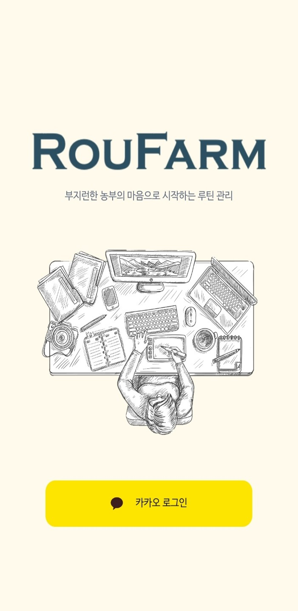
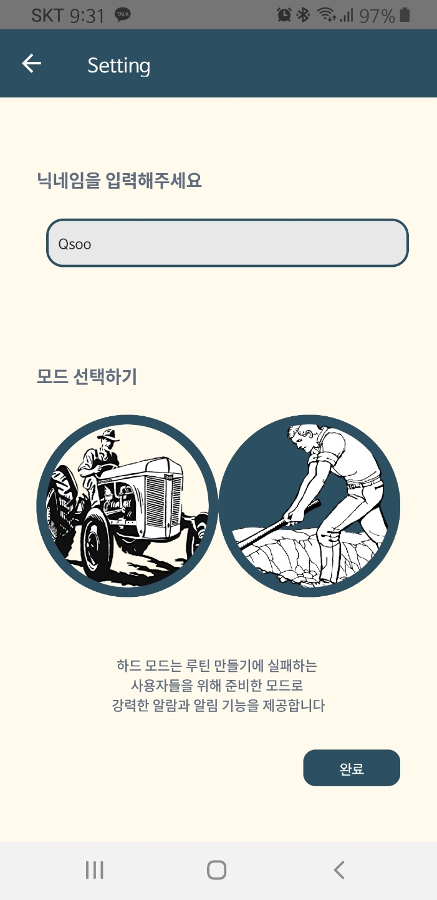
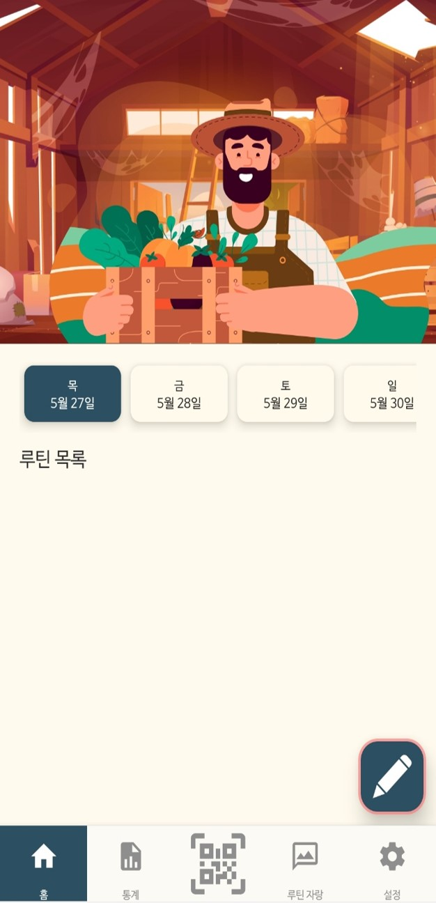
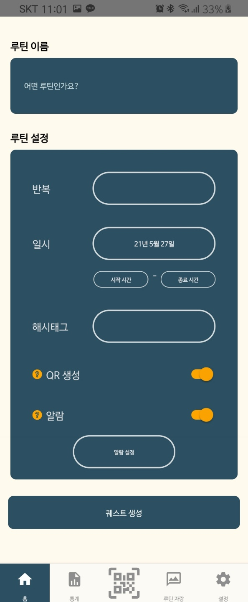
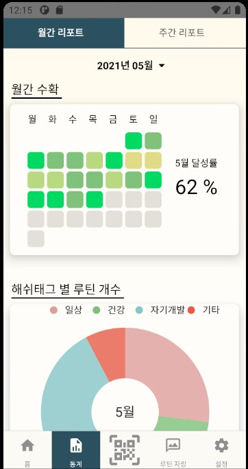
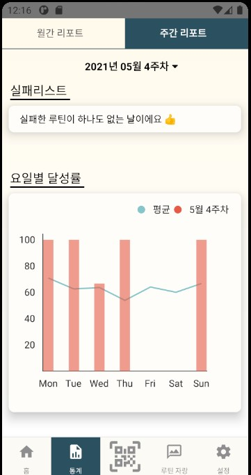
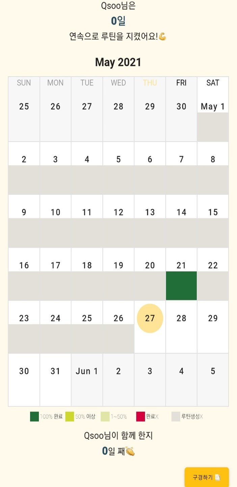
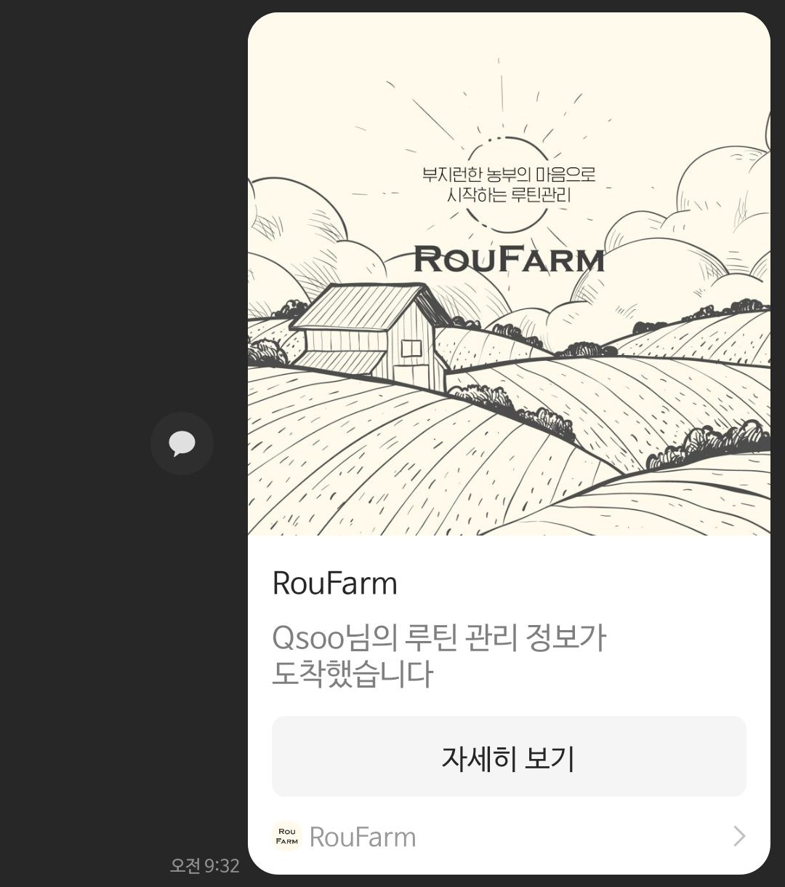
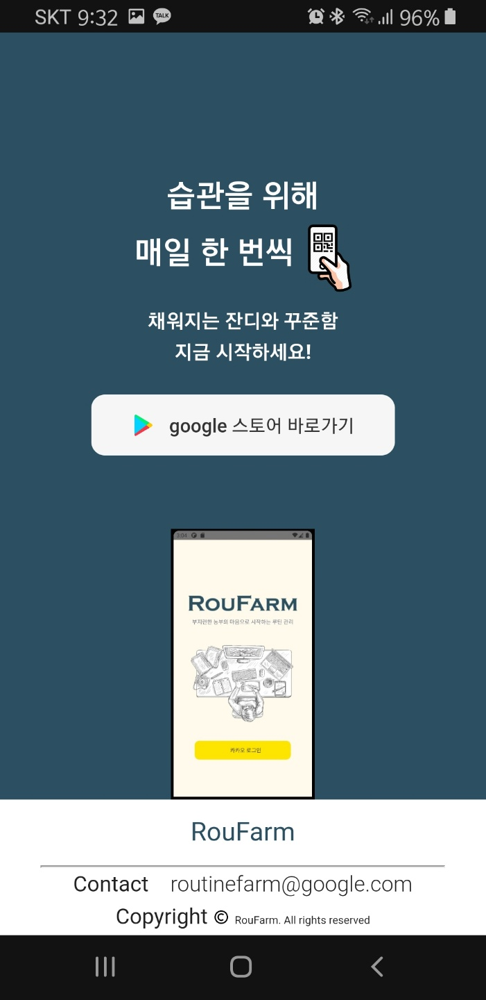
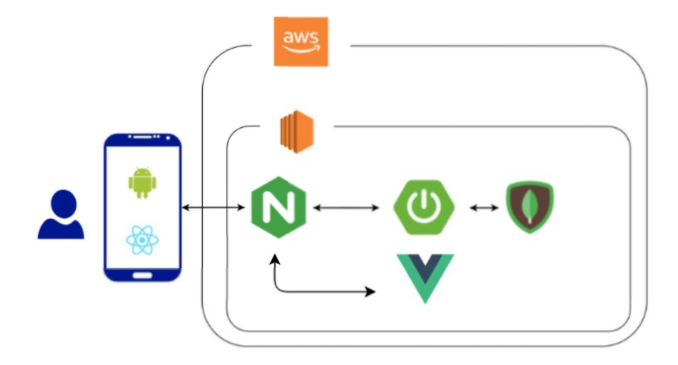

## RouFarm

>  **습관을 만드는데 어려움이 있는 사람을 위한 루틴 관리 앱**
>
> 프로젝트 기간: 21.04.12 ~ 21.05.21(6주)

[소개 동영상 보러 가기](https://www.youtube.com/watch?v=BNGxon0wl0o)

### 목차

[팀원 소개](#팀원-소개)

[서비스 소개](#roufarm은)

[기능 소개](#주요-기능-화면-예시)

[관련 문서](#관련-문서)

- 기능 명세서
- API 설계
- 와이어 프레임
- 시스템 아키텍쳐

### 팀원 소개

| 이름         | 역할                     | 프로필                                  |
| ------------ | ------------------------ | --------------------------------------- |
| 이강림(팀장) | 풀스택 개발              | [github](https://github.com/leekangrim) |
| 빈준호       | 백엔드 개발자, 영상 제작 | [github](https://github.com/Rekalux)    |
| 오수완       | 프론트 엔드 개발자       | [github](https://github.com/swanious)   |
| 최규수       | 프론트 엔드 개발자       | [github](https://github.com/qsoo)       |
| 황승주       | 프론트 엔드 개발자       | [github](https://github.com/wealways)   |

### RouFarm은

<u>습관을 쉽고 재밌게</u>라는 생각을 가지고 새로운 습관을 만드는데 도움을 줄 수 있는 

**루틴 관리 서비스**를 지향하고 있습니다. 

- 사용자는 모드 선택(Hard/Soft)을 통해 자율적, 강제적 루틴 수행 확인 가능
- Hard mode: 루틴 생성시 QR 코드 생성을 통해 QR 인식을 통해서만 알람 및 알림 off 가능
- Soft mode: 루틴 생성시 QR 코드, 알람, 알림을 선택적으로 설정 가능
- 월 별, 일 별, 해시태그 별 루틴 통계 자료 조회
- 카카오 메세지를 통한 루틴 형성 독려 

### 주요 기능 화면 예시

#### 스플래쉬 이미지

앱 처음 실행시 확인할 수 있는 화면

서비스 정체성을 표현하기 위해 농촌의 모습을 표현하려고 하였음

#### 로그인(소셜 로그인 - kakaotalk)

사용자들의 편의성을 고려하여 소셜 로그인 중 카카오톡 로그인을 이용

자체 로그인과 카카오 로그인을 연결

#### 모드 선택

QR, 알람, 알림 등의 기능을 선택적으로 사용할 수 있는지 아닌지 여부를 결정하게 되는

Soft/Hard 모드 선택 및 닉네임 변경 가능

#### 메인 화면

사용자가 만든 루틴들을 일별로 조회할 수 있고 루틴을 생성할 수 있는 서비스의 메인 페이지

#### 루틴 생성화면

반복 일자를 설정하여 매주 반복을 설정할 수 있고 시작과 종료 시간을 설정하여 사용할 수 있음

#### 리포트 화면

월 간/주 간/일 간 사용 데이터를 활용하여 사용자들의 사용성 증진 목표

실패 리스트를 보여줌으로서 self-check에 도움코자 기능 추가

#### 루틴 공유하기

루틴을 지킨 모습을 공유하여 잘 지켰다면 긍정적인 피드백으로 루틴 형성 강화 

못 지켰다면 부정적인 피드백으로 채찍질을 가능케 하는데 도움이 되고자 추가한 기능

공유된 링크를 통해 접속한 웹 사이트에선 해당 사용자의 이번 달 루틴 수행 정보 확인 가능

카카오톡 링크 공유 예시

#### 웹 소개 페이지

앱 유입을 위한 앱 소개 페이지

### 관련 문서

| 문서 명                                                      | 내용                                                         | 비고                                     |
| ------------------------------------------------------------ | ------------------------------------------------------------ | ---------------------------------------- |
| [기능명세서](./assets/기능명세서.pdf)                        | 설계 단계에서 사용한 기능명세서 내용 Jira 분류 이용(epic - story - subtask) | 핵심 구현 기능과 선택 구현 기능으로 분류 |
| [API 설계](https://www.notion.so/roufarm/API-24705f7437a04c9db2384ec7dabc77f7) | endpoint 및 request - response 구조 설계                     | 추가적인 요구사항 설계를 통해 소통       |
| [와이어 프레임](./assets/wireframe.xd)                       | 와이어 프레임 설계(Adobe XD)                                 |                                          |

### 시스템 아키텍쳐

